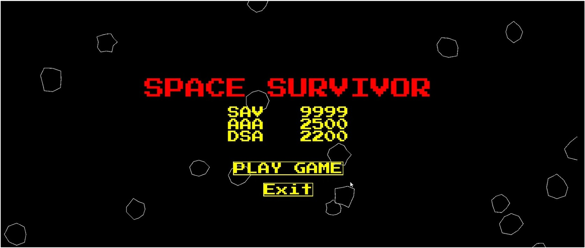
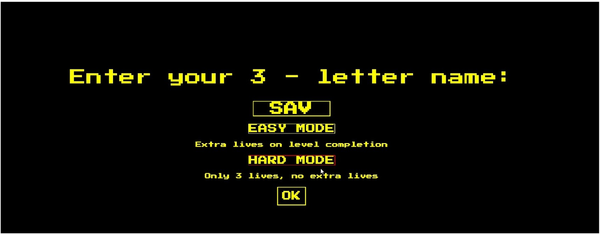
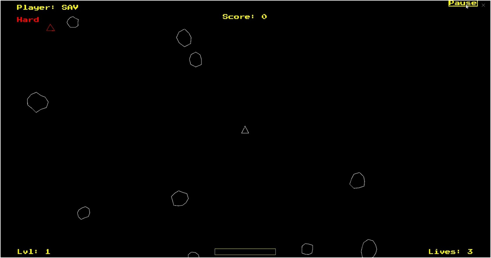
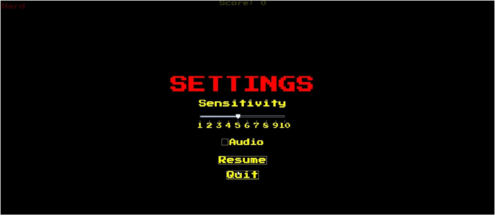
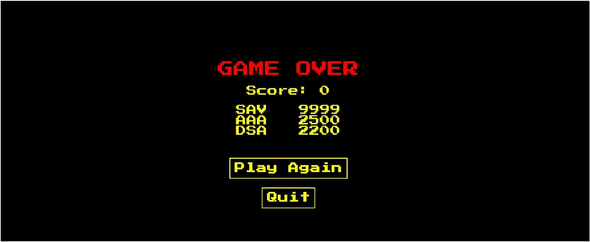

# Java 2D Implementation of Asteroids

intro

player name selection

gameplay

settings menu

game over

### **How to Run**

1. Ensure Java Development Kit (JDK) 17 or higher is installed.
2. Open the project in your IDE (IntelliJ IDEA, Eclipse).
3. Run the `StartGame` Java file located in `SpaceSurvivorGame package`
---
### **Game Features Overview**

| 🎮 Features                          | Description |
|------------------------------------|-------------|
| **Retro-Inspired Visual Style**    | Pixelated fonts, high contrast colors (black, yellow, red), arcade aesthetic with particle explosion effects |
| **Player Controls**                | Arrow keys for movement/rotation, spacebar to shoot, pause via on-screen button |
| **Dynamic Difficulty Scaling**     | More asteroids spawn each level, difficulty increases with progression |
| **Player and Enemy Movement**      | Player: keyboard-based; Enemy: AI tracks player with intelligent behavior |
| **Collision Detection System**     | Detects overlaps based on positions and radii for all objects |
| **Advanced Collision Handling**    | Handles different interaction types (bullet vs asteroid, ship vs asteroid, etc.) |
| **Persistent High Score Tracking** | Saves and displays top 3 scores from `highscores.txt` |
| **Sound Management**               | Background music (looping), SFX for shooting, deaths, explosions with toggle support |
| **Pause & Settings Menu**          | Includes pause/resume, sensitivity slider, audio toggle |
| **Game Over & Replay System**      | Shows final score; allows restart or quit from Game Over screen |
| **Level Progress Bar**             | Displays asteroid destruction progress visually during gameplay |
| **Particle Effects**               | Orange explosion particles triggered on collisions |
| **Difficulty Modes**               | Easy: gain life after level; Hard: fixed 3 lives, no recovery |

---
